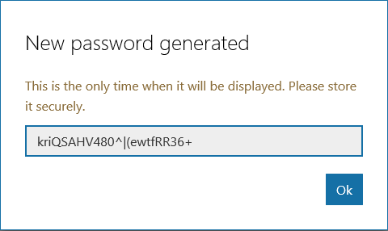

# Getting Started with the Outlook Mail API and Node.js #

This sample app is the result of following the tutorial at [https://docs.microsoft.com/en-us/outlook/rest/node-tutorial](https://docs.microsoft.com/en-us/outlook/rest/node-tutorial). If you follow that tutorial, you should come up with something fairly close to the code in this repository.

> **NOTE:** Looking for the version of this tutorial that used the Outlook API directly instead of Microsoft Graph? Check out the `outlook-api` branch. Note that Microsoft recommends using the Microsoft Graph to access mail, calendar, and contacts. You should use the Outlook APIs directly (via https://outlook.office.com/api) only if you require a feature that is not available on the Graph endpoints.

## Prerequisites

- Node.js installed and working on your development machine. 
- An Office 365 tenant, with access to an administrator account in that tenant, **OR** an Outlook.com account.

## Running the sample

If you didn't follow the tutorial and just want to download this repo and try it out, you need to do a few things first.

## Register the app

Before we proceed, we need to register our app to obtain a client ID and secret. Head over to https://apps.dev.microsoft.com to quickly get a client ID and secret. Using the sign in buttons, sign in with either your Microsoft account (Outlook.com), or your work or school account (Office 365).

Once you're signed in, click the **Add an app** button. Enter `node-tutorial` for the name and click **Create application**. After the app is created, locate the **Application Secrets** section, and click the **Generate New Password** button. Copy the password now and save it to a safe place. Once you've copied the password, click **Ok**.



Locate the **Platforms** section, and click **Add Platform**. Choose **Web**, then enter `http://localhost:3000/authorize` under **Redirect URIs**. Click **Save** to complete the registration. Copy the **Application Id** and save it along with the password you copied earlier. We'll need those values soon.

Here's what the details of your app registration should look like when you are done.


## Configure the sample

Rename the `sample.env` file to `.env`. Replace the `YOUR APP ID HERE` with the application ID and `YOUR APP PASSWORD HERE` with the password you generated and save your changes.

Open your command prompt or shell and enter the following command to install dependencies.

```Shell
npm install
```

## Run the sample

Open your command prompt or shell and enter the following command.

```Shell
npm start
```

## Copyright ##

Copyright (c) Microsoft. All rights reserved.

----------
Connect with me on Twitter [@JasonJohMSFT](https://twitter.com/JasonJohMSFT)

Follow the [Outlook/Exchange Dev Blog](https://blogs.msdn.microsoft.com/exchangedev/)
